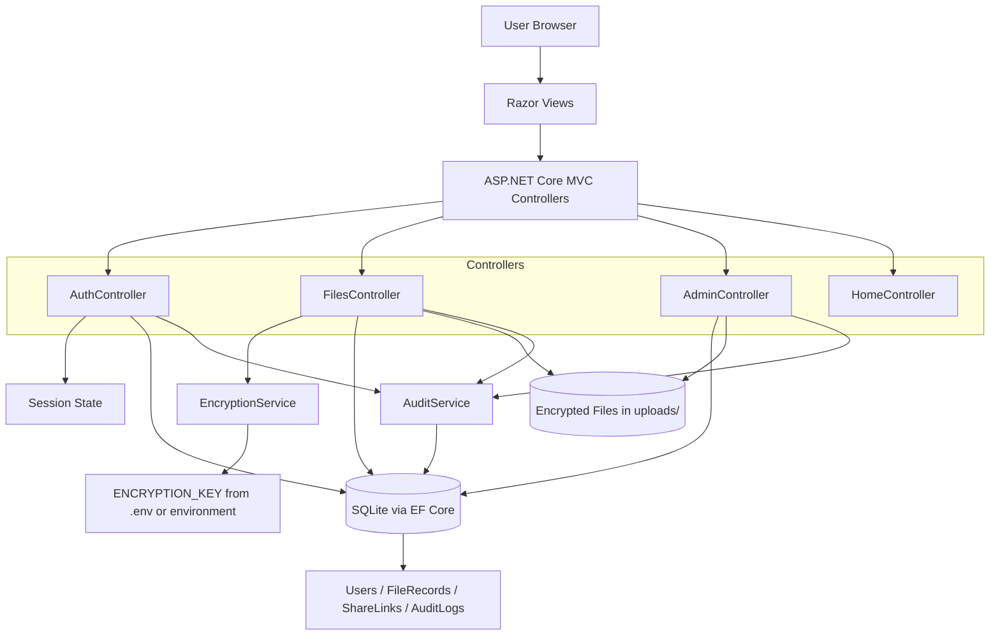

# SecureFileHub Analysis Report

## Executive Summary

`SecureFileHub` is an ASP.NET Core MVC application targeting `.NET 9` for secure file upload, encrypted storage, controlled sharing, and administrative auditing. The current directory shows a conventional MVC layout with:

- Presentation: Razor views under `Views/`
- Request handling: MVC controllers under `Controllers/`
- Persistence: EF Core with SQLite via `Data/AppDbContext.cs`
- Domain entities: `Models/`
- Security/support services: `Services/EncryptionService.cs` and `Services/AuditService.cs`

The solution builds successfully in its current state with `dotnet build`.

## Project Structure

Key directories and files:

- `Program.cs`: application bootstrap, DI registration, middleware, session, security headers, migrations, dev seed users
- `Controllers/`: auth, file management, admin, and home routes
- `Data/AppDbContext.cs`: EF Core context and entity registration
- `Models/`: `User`, `FileRecord`, `ShareLink`, `AuditLog`
- `Services/`: encryption-at-rest and audit logging
- `ViewModels/`: login and registration validation models
- `Views/`: Razor UI for auth, file operations, sharing, and admin monitoring
- `Migrations/`: EF Core schema history
- `wwwroot/`: static assets and vendor libraries
- `.env.example`: expected `ENCRYPTION_KEY` secret

## Technology Stack

- Framework: ASP.NET Core MVC
- Target runtime: `.NET 9`
- ORM: Entity Framework Core `9.0.13`
- Database: SQLite
- Password hashing: `BCrypt.Net-Next`
- Secret loading: `DotNetEnv`
- Frontend: Razor views, Bootstrap, jQuery validation
- Session/auth style: custom session-based authentication

## Architecture Overview

The application uses a layered MVC-style architecture. Controllers coordinate input validation, access control, and persistence. Services encapsulate encryption and auditing. Metadata is stored in SQLite, while encrypted file blobs are stored on disk in an `uploads/` folder under the content root.

## Functional Analysis

### 1. Authentication and Session Management

Implemented in `Controllers/AuthController.cs`.

- Registration validates email and password complexity
- Passwords are hashed with BCrypt using work factor `12`
- Duplicate email registration is prevented in code and by a unique DB index
- Login tracks failed attempts and applies timed lockout
- User identity is stored in session keys:
  - `UserId`
  - `UserEmail`
  - `UserRole`
- Logout clears the full session

### 2. File Upload and Storage

Implemented in `Controllers/FilesController.cs`.

- Only authenticated users can upload
- File constraints include:
  - size limit: `10 MB`
  - extension allowlist: `.pdf`, `.docx`, `.png`, `.jpg`, `.txt`
  - magic-byte validation for several formats
- Original filenames are not used on disk
- Stored file names are randomized GUID-based `.bin` names
- File contents are encrypted before writing to disk
- File metadata is stored in `FileRecord`

### 3. File Access and Sharing

- File listing is filtered by owner unless the session role is `Admin`
- Download enforces ownership/admin authorization checks to reduce IDOR risk
- Share links support:
  - tokenized public access
  - expiry timestamps
  - optional password protection
  - permission mode: `View` or `Download`
- Shared downloads decrypt the file before response delivery

### 4. Administration

Implemented in `Controllers/AdminController.cs`.

- Admin-only dashboard
- Displays:
  - recent audit logs
  - all users
  - all files
- Supports deleting a user and their files

## Data Model

### `User`

- identity and email
- password hash
- role
- creation timestamp
- failed login count
- lockout timestamp

### `FileRecord`

- owner reference
- original display name
- stored disk name
- content type
- file size
- upload timestamp

### `ShareLink`

- file reference
- token
- permission
- expiry
- optional password hash
- creation timestamp

### `AuditLog`

- event name
- related user id
- IP address
- details
- timestamp

## Security Posture

Current security controls identified in the code:

- BCrypt password hashing
- account lockout after repeated failed logins
- CSRF protection with `[ValidateAntiForgeryToken]`
- strict session cookie settings
- HTTPS redirection
- HSTS outside development
- security response headers:
  - `X-Content-Type-Options`
  - `X-Frame-Options`
  - `Content-Security-Policy`
  - `Referrer-Policy`
  - `Permissions-Policy`
- server-side authorization checks on file access and deletion
- encryption at rest using `AesGcm`
- audit logging for sensitive actions

## Strengths

- Clear separation of responsibilities across controllers, models, and services
- Good baseline security mindset for a course-scale application
- Encryption is integrated into the file storage workflow rather than treated as optional
- Share links include expiry and optional password protection
- Database migrations are present, making schema state reproducible
- Build is currently clean with no warnings or errors

## Risks and Observations

### 1. Authentication is custom rather than ASP.NET Identity

The application uses session keys directly instead of the built-in ASP.NET Core Identity stack. This is workable for learning purposes, but it increases the amount of security-sensitive logic maintained manually.

### 2. Admin authorization is session-string based

Role checks rely on `HttpContext.Session.GetString("UserRole")`. This is simple, but it bypasses the richer policy/claims model available in the framework.

### 3. Share links are not tied to rate limiting or access attempt limits

Password-protected share links verify passwords, but there is no apparent throttling for repeated share-password guesses.

### 4. File blobs are stored on local disk

This is fine for local or single-server deployment, but it becomes an operational constraint for scaling, backups, and multi-instance hosting.

### 5. No automated test project was found

The current directory does not contain a separate test project, so behavior is verified mainly through build success and manual/runtime testing.

### 6. Memory usage could grow with larger files

`EncryptionService` reads whole streams/files into memory before encryption/decryption. This is acceptable for the current `10 MB` limit, but it would be less suitable if file size limits increase.

## Suggested Improvements

Recommended next steps:

1. Migrate authentication and authorization to ASP.NET Core Identity and policy-based authorization.
2. Add automated tests for auth, file authorization, and share-link expiry/password behavior.
3. Add rate limiting for login and public share-link password attempts.
4. Consider virus scanning or content scanning for uploaded files.
5. Move file storage to a managed object store if multi-instance deployment is expected.
6. Separate operational secrets and environment-specific configuration more explicitly for production deployment.

## Conclusion

This directory contains a working secure file-sharing web application with a solid educational architecture: MVC controllers, EF Core persistence, encrypted file storage, audit logging, and session-based access control. It is organized clearly, builds successfully, and demonstrates several important secure development practices, while still leaving room for production-hardening around identity, testing, rate limiting, and deployment architecture.
